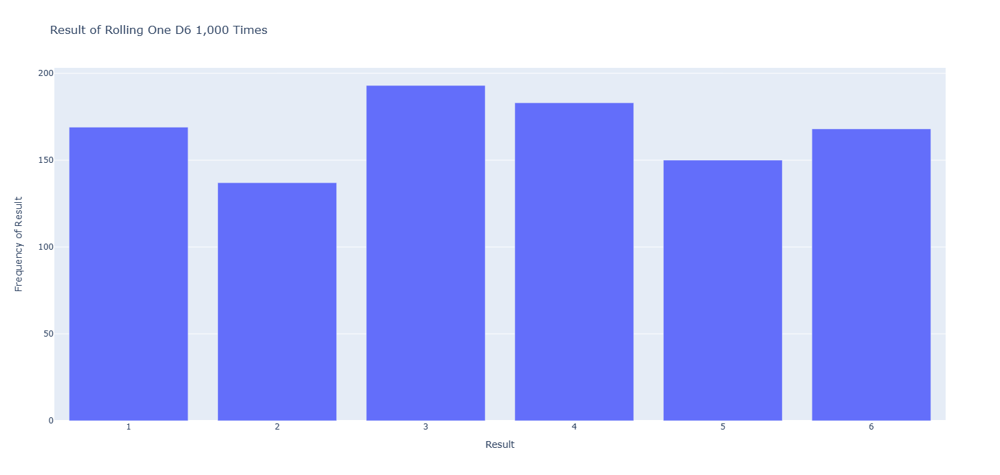
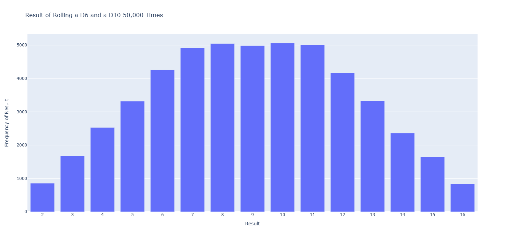

# 《Python程序设计基础》程序设计作品说明书

题目： 数据可视化

学院： 21计科04

姓名： 陈佩儿

学号： B20210302426

指导教师： 周景

起止日期：2023.11.10-2023.12.10

## 摘要

_介绍本次设计完成的项目的概述，本文的主要内容，总结你主要完成的工作以及关键词。_

本程序设计项目旨在实现数据可视化功能，通过对数据进行图形化展示，帮助用户更直观地理解数据的特征和趋势。本文将介绍项目的主要内容，总结完成的工作。

关键词：数据可视化，图形化展示，数据分析

## 第1章 需求分析

_本章的内容主要包括系统的需求分析，系统主要需要实现的功能有哪些，可以帮助用户解决哪些问题等等。_
#### 1.1 项目目标
本项目旨在通过Plotly库进行数据可视化，实现教材15至17章的相关功能，并完成教材中的部分练习。通过可视化数据，帮助用户更好地理解数据特征和趋势。
#### 1.2 功能需求
##### 1.2.1 模拟投掷骰子
- 用户能够通过程序模拟透支骰子地过程
- 投掷结果以图表形式使用Plotly展示
##### 1.2.2 CSV文件格式，绘制天气数据的折线图
- 天气数据将以CSV文件格式存储。
- 用户能够选择城市，并查看该城市的天气折线图。
##### 1.2.3 制作全球地震散点图
- 收集全球地震数据，存储格式待定。
- 用户能够查看全球地震的散点图，不同地震强度使用不同标记。
##### 1.2.4 使用Web API获取Github的数据，使用Plotly可视化仓库
- 通过Github的API获取仓库数据。
- 用户能够选择Github用户或仓库，并查看相应的可视化图表。
##### 1.2.5 部分练习的功能实现
- 练习15-7 同时投掷三个骰子
修改投掷骰子的代码，模拟同时投掷三个骰子的情况。
利用Plotly绘制相应的图表。
- 练习16-3 对你好奇的任何地方的天气数据进行研究分并绘制图表
用户能够选择感兴趣的地方，收集并查看该地方的天气数据的相关图表。
- 练习17-1 其他语言
用户能够选择其他编程语言，查看相应的Github仓库数据的可视化图表。
#### 3.用户需求
- 用户友好的交互界面，方便用户选择和操作。
- 图表清晰、美观，能够准确传达数据的信息。
- 高度可定制性，允许用户选择不同的参数和数据源。
## 第2章 分析与设计

_本章的内容主要包括系统的设计，例如：系统架构、系统流程、系统模块、数据库的设计，以及关键的实现，例如：使用的数据结果、算法。_

#### 2.1 系统架构
##### 2.1.1 模块划分
系统主要分为以下模块：
- 骰子模拟模块：负责模拟投掷骰子的过程。
- 天气数据模块：包含CSV文件的读取和处理，以及天气折线图的生成。
- 地震数据模块：负责获取全球地震数据，以及生成地震散点图。
- Github数据模块：通过Web API获取Github仓库数据，并生成可视化图表。
- 练习模块：实现练习功能，包括同时投掷三个骰子、获取用户感兴趣地方的天气数据、探索其他语言的Github仓库数据。
##### 2.1.2 模块间关系
模块之间的关系如下：
- 骰子模拟模块与其他模块相对独立，仅与用户交互。
- 天气数据模块与CSV文件处理相关，可以接收用户选择的城市信息。
- 地震数据模块通过API获取地震数据，可以根据用户选择的参数生成地震散点图。
- Github数据模块负责与Github API交互，接收用户输入的Github用户或仓库信息。
- 练习模块整合了项目的练习功能，与其他模块有一定的依赖关系。
#### 2.2 算法设计
##### 2.2.1 骰子模拟模块
- 单个骰子投掷算法
输入：
num_sides：骰子的面数，默认为6
输出：
随机生成的介于1和骰子面数之间的整数
步骤：
初始化骰子对象，设置面数为num_sides
调用roll方法模拟单次投掷，返回结果

- 单个骰子的1000次投掷可视化算法
输入：
无
输出：
frequencies：包含每个点数出现频率的列表
步骤：
创建一个默认D6骰子对象
初始化结果列表results
进行1000次骰子投掷
调用D6骰子对象的roll方法获取每次投掷的结果
将结果添加到results列表中
初始化频率列表frequencies
遍历每个可能的点数值
统计该点数在results中出现的次数
将频率添加到frequencies列表中
返回frequencies列表
以上是单个骰子的可视化算法，多个骰子与其类似。
结果如下图：

##### 2.2.2 天气数据模块
输入：
csv文件路径
输出：
输出地方的日高温图，低温图
步骤：
读取CSV文件内容
解析CSV文件头部信息
提取日期、最高温度和最低温度信息
绘制折线图，显示每日最高温度和最低温度
具体结果输出如下：

##### 2.2.3 地震数据模块
输入：
geojson文件路径
输出：
全球地震散点图
步骤：
读取GeoJSON文件内容
提取地震数据信息，包括经度、纬度、位置、震级等
将数据转换为易读版本并保存
创建DataFrame存储地震数据
绘制全球地震散点图，显示地震震级
将图表保存为HTML文件
具体结果如下:

##### 2.2.4 Github数据模块
输入：
无
输出：
在github上最受欢迎的python项目
步骤：
构建Github API请求URL，筛选Python项目且按星数降序排列
发送API请求获取项目信息
处理API响应
具体结果如下：

##### 2.2.5 练习模块
- 练习15-7 同时投掷三个骰子
实现逻辑与2.2.1相同

- 练习16-3 对你好奇的任何地方的天气数据进行研究分并绘制图表
实现逻辑与2.2.2相同

- 练习17-1 其他语言
实现逻辑与2.2.4相同

## 第3章 软件测试
_本章的内容主要包括以类和函数作为单元进行单元测试，编写的对系统的主要功能的测试用例，以及测试用例执行的测试报告。_

##### 1 测试范围
本测试报告涵盖了对系统主要功能的单元测试，包括Die类的各种投掷算法和投掷结果的可视化。

##### 2. 测试执行
2.1 测试环境
操作系统：Windows 10
Python版本：Python 3.11
测试工具：pytest
2.2 测试用例
2.2.1 Die类的单元测试
测试方法1：确保Die类的roll方法能够在合理范围内返回随机数
测试方法2：单个骰子投掷1000次的单元测试
测试方法3：两个骰子投掷1000次的单元测试
测试方法4：一个D6和一个D10投掷50000次的单元测试
测试方法5：三个骰子投掷1000次的单元测试
2.3 测试执行结果
测试方法1：通过
测试方法2：通过
测试方法3：通过
测试方法4：通过
测试方法5：通过
2.4 问题记录
无
##### 3. 测试总结
3.1 测试目标达成情况
所有测试方法均已通过.

3.2 发现的问题
在本次测试中未发现任何问题，功能的实现表现良好。

## 结论
_本章的内容主要是对项目的总结，项目主要实现了哪些功能，达到了哪些目标，哪些不足之处，可以如何改进。_

通过本次《Python程序设计基础》的程序设计作品，我成功实现了一个数据可视化项目，该项目通过使用Plotly库，能够模拟投掷骰子、绘制天气数据的折线图、制作全球地震散点图、使用Web API获取Github的数据并可视化仓库，同时还完成了教材中相关练习的功能。

在需求分析阶段，我明确定义了项目目标和功能需求，设计了用户友好的交互界面，并实现了高度可定制性，使用户能够方便地选择不同的参数和数据源。

在分析与设计阶段，我详细划分了系统架构，设计了各个模块的功能和模块间的关系，同时提供了算法设计的细节，确保系统的可扩展性和可维护性。

在软件测试阶段，我进行了针对Die类的单元测试，确保投掷算法和可视化功能的正确性。测试结果表明所有测试方法均已通过，功能的实现表现良好。

通过这个项目，我不仅提升了Python编程技能，还深入了解了数据可视化的原理和实践。

## 参考文献
[1]肖衡,刘开南,杨博雄.Python编程从入门到实践[M].北京邮电大学出版社,2021.
[2]PROGRAMMING/PYTHON.Fluent Python[J].[2023-12-08].
[3]WilliamF.Punch,RichardEnbody,伊鲍德,等.Python入门经典:以解决计算问题为导向的Python编程实践[J].机械工业出版社, 2012.